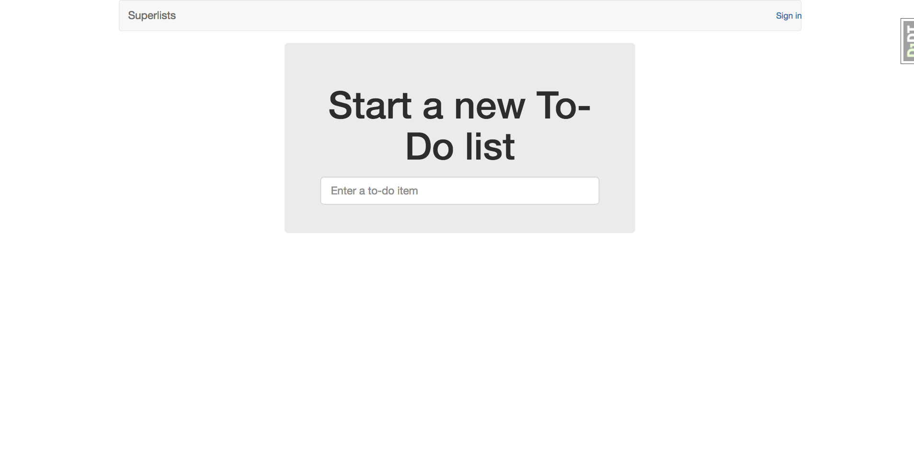

# Test-Driven Development with Python - Book source Code

## Introduction

This is a Django web application built following Harry Percival's Test-Driven Development with Python.

It's a to-do list application which allows users to register for accounts, share lists, add, remove, and update items in a list.

## Screenshot

## Installation instructions

* Install `Python 3`, `virtualenv`, and `virtualenvwrapper`
* Create the virtual environment (`mkvirtualenv tdd --python=python3`)
* Install the requirements (`pip install -r requirements.txt`)
* Run the server(`python manage.py runserver`)